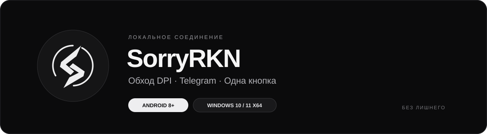
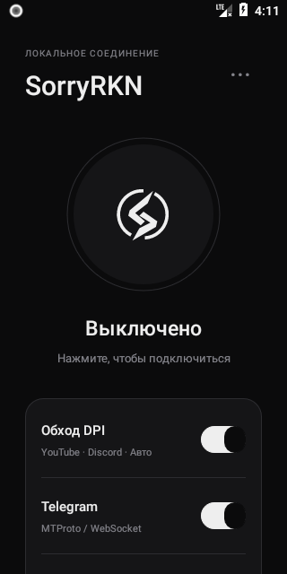
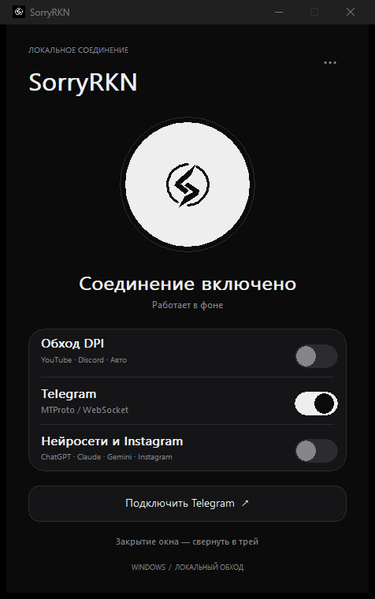

  

  Минималистичное приложение для обхода DPI и подключения Telegram. 
  Автоподбор методов, работа в фоне и управление одной кнопкой.

  <a href="#скачивание">Скачать</a> ·
  <a href="docs/ANDROID.md">Android</a> ·
  <a href="docs/WINDOWS.md">Windows</a> ·
  <a href="docs/FAQ.md">Помощь</a> ·
  <a href="https://github.com/Def01d/SorryRKN/releases">Релизы</a>

## Скачивание

| Платформа | Версия | Скачать | Требования |
| --- | --- | --- | --- |
| **Android** | **0.9.0** | [**Скачать APK**](https://raw.githubusercontent.com/Def01d/SorryRKN/v0.9.0/SorryRKN-0.9.0.apk) | Android 8.0+, ARM64 или x86_64; root не нужен |
| **Windows** | **1.1.0** | [**Скачать установщик**](https://raw.githubusercontent.com/Def01d/SorryRKN/windows-v1.1.0/windows/SorryRKN-Windows-1.1.0-Setup.exe) | Windows 10/11 x64, Intel/AMD; запуск с правами администратора |
| **Windows Portable** | **1.1.0** | [**Скачать ZIP**](https://raw.githubusercontent.com/Def01d/SorryRKN/windows-v1.1.0/windows/SorryRKN-Windows-1.1.0.zip) | Распакуйте весь архив и запустите `SorryRKN.exe` |

[Что изменилось](CHANGELOG.md) · [Контрольные суммы Android](SHA256SUMS.txt) · [Контрольные суммы Windows](windows/SHA256SUMS.txt)

Готовые файлы доступны по ссылкам выше. Автоматические архивы GitHub **«Source code»** на странице релиза не являются установщиками.

Обновление поверх установленной версии сохраняет настройки. Пользователи GrayBridge 0.7 могут установить актуальный APK поверх старого приложения: пакет и подпись сохранены.

## Возможности

- **Обход DPI.** Методы для YouTube, Discord и других сайтов; автоматический и ручной выбор. В Windows доступно 22 профиля оригинального zapret/winws.
- **Telegram.** Встроенный локальный MTProto → WebSocket/HTTP2 прокси. Подключается кнопкой в приложении; Python уже включён.
- **Нейросети и Instagram.** Отдельный профиль для ChatGPT, Claude, Gemini и Instagram. Для нейросетей используется выборочный Comss DNS, для Instagram — отдельный метод DPI.
- **Работа в фоне.** Android: плитка рядом с Wi-Fi и Bluetooth. Windows: включение и выключение через системный трей.
- **Обновления с GitHub.** Обновление совместимых списков, параметров и Telegram-доменов; предложение новых версий приложения при запуске.
- **Мои ресурсы.** Пользовательские домены DNS-профиля и прямые исключения с приоритетом. [Как настроить](docs/USER-RULES.md).
- **Монохромный интерфейс.** Большая кнопка соединения, три переключателя и короткое меню.

Результат зависит от оператора, маршрута и сервиса. Профиль нейросетей не предоставляет зарубежный IP всем приложениям и не снимает ограничения аккаунтов. Подробнее — в [ответах на частые вопросы](docs/FAQ.md).

## Как начать

### Android

1. Скачайте APK, откройте его и разрешите установку из выбранного браузера или файлового менеджера.
2. Откройте SorryRKN, включите нужные переключатели и нажмите большую кнопку. Подтвердите системный запрос VPN.
3. Для Telegram нажмите **«Подключить Telegram»** и подтвердите добавление прокси.

[Подробная инструкция: фон, плитка в шторке и обновления →](docs/ANDROID.md)

### Windows

1. Установите приложение или распакуйте переносной ZIP целиком.
2. Запустите SorryRKN, подтвердите запрос прав администратора, выберите сервисы и нажмите большую кнопку.
3. Для Telegram нажмите **«Подключить Telegram»**. Закрытие окна оставляет приложение работать в трее; полное завершение — **«Выход»** в меню значка.

[Подробная инструкция: трей, выбор метода и обновления →](docs/WINDOWS.md)

## Интерфейс

<table>
  <tr><th>Android</th><th>Windows</th></tr>
  <tr>
    <td align="center"></td>
    <td align="center"></td>
  </tr>
</table>

Снимки настоящих приложений; переключатели на них показывают разные режимы.

## Обновления

**Данные обхода** и **само приложение** обновляются отдельно. Новые списки и совместимые параметры применяются без переустановки; новые алгоритмы движка требуют новой версии программы. Установка программы начинается после подтверждения пользователя.

| Действие | Android | Windows |
| --- | --- | --- |
| Проверить новую версию | `··· → Обновить приложение` | `··· → Обновить приложение` |
| Обновить данные | `··· → Обновления GitHub → Проверить сейчас` | `··· → Обновить данные GitHub` |
| Изменить автопроверку данных | `··· → Обновления GitHub` | `··· → Обновлять данные автоматически` |

Android и Windows используют отдельные источники обновлений и сохраняют свои версии.

## Нужна помощь?

Начните с [FAQ и решения частых проблем](docs/FAQ.md). Если проблема повторяется, откройте [сообщение об ошибке](https://github.com/Def01d/SorryRKN/issues/new?template=bug_report.yml) и приложите диагностику из меню приложения, указав устройство, систему, оператора и тип соединения.

[Предложить улучшение](https://github.com/Def01d/SorryRKN/issues/new?template=feature_request.yml) · [Участие в проекте](CONTRIBUTING.md) · [Приватность](docs/PRIVACY.md)

## Код и компоненты

[Исходники Windows](windows/src) · [Сборка Windows](windows/src/BUILD.md) · [Проверки Windows](windows/VALIDATION.md) · [Проверки Android](docs/VALIDATION-ANDROID.md)

В этом репозитории опубликованы APK Android, установщик и переносная сборка Windows, документация и исходники Windows. Исходники Android пока здесь не размещены.

SorryRKN — независимая адаптация открытых компонентов, а не официальный продукт их авторов:

| Компонент | Использование |
| --- | --- |
| [Flowseal/zapret-discord-youtube](https://github.com/Flowseal/zapret-discord-youtube) | Каталог методов и данные обхода; оригинальный winws в Windows |
| [Flowseal/tg-ws-proxy](https://github.com/Flowseal/tg-ws-proxy) | Telegram-прокси |
| [zapret](https://github.com/bol-van/zapret) и [ByeDPI](https://github.com/hufrea/byedpi) | Движки обхода |
| [WinDivert](https://github.com/basil00/WinDivert) | Обработка сетевого трафика Windows |
| [hev-socks5-tunnel](https://github.com/heiher/hev-socks5-tunnel) | Обработка локального VPN Android |

Лицензии Android доступны в **«О приложении → Лицензии»**, Windows — в папке `licenses` рядом с программой. Лицензия собственного кода Windows и notices зависимостей включены в его исходники и дистрибутив.
