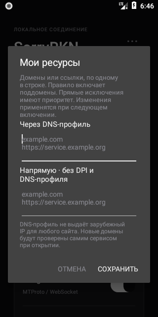
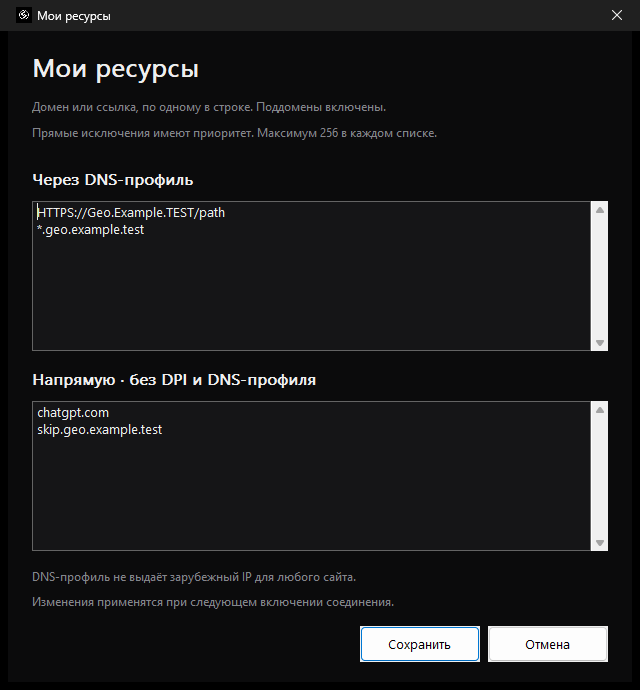

# Мои ресурсы

[← Главная](../README.md) · [Android](ANDROID.md) · [Windows](WINDOWS.md) · [Помощь](FAQ.md)

Доступно в **Android 0.9+** и **Windows 1.1+**. Меню **`··· → Мои ресурсы`**; в Windows — также через правый клик по значку трея.

<table>
<tr><th>Android</th><th>Windows</th></tr>
<tr><td></td><td></td></tr>
</table>

Снимок Android выше относится к прежней версии. В Android 0.10.0 первый список переименован в «Обход DPI · ваш IP».

## Два списка

| Список | Android 0.10.0 | Windows 1.1.0 |
| --- | --- | --- |
| **Обход DPI · ваш IP** / **Через DNS-профиль** | Обычный защищённый DNS и локальная обработка DPI; сторонние реле не используются | Comss DNS и полученный маршрут |
| **Напрямую** | Обычный DNS, соединение без обработки DPI | Исключение из специального DNS-профиля и DPI |

«Напрямую» имеет наивысший приоритет, включая правила поддоменов. При обновлении Android на 0.10.0 записи сохраняются, но первый список теперь выбирает локальный обход DPI со своим IP вместо Comss-профиля.

## Как добавить сайт

1. Откройте **«Мои ресурсы»**.
2. Вставьте домены или HTTP/HTTPS-ссылки, по одной записи в строке, в нужный список.
3. Нажмите **«Сохранить»**. Если запись ошибочна, исправьте её — весь список сохраняется только после проверки.
4. Выключите и снова включите соединение SorryRKN. Перезапустите браузер или проверяемое приложение, чтобы обновить его DNS-кеш и соединения.

Пример списка обхода:

```text
service.example.com
https://another.example.org/account
```

Пример прямых исключений:

```text
bank.example.net
login.service.example.com
```

Это демонстрационные имена — замените их своими сайтами. В примере `login.service.example.com` подключается напрямую, а другие поддомены `service.example.com` используют выбранный способ обхода для вашей платформы.

## Формат и область правила

- `example.com` включает сам домен и все его поддомены: `www.example.com`, `api.example.com` и т. д.
- Чтобы ограничить правило одним разделом сервиса, укажите его поддомен, например `api.example.com`.
- В ссылке сохраняется только домен. Путь `/account`, номер порта и параметры ссылки не ограничивают правило.
- `*.example.com` сохраняется как `example.com` и включает также корневой домен.
- Международные домены, например `пример.рф`, преобразуются в ASCII/Punycode. Регистр не важен; повторы удаляются.
- Не более **256 доменов в каждом списке**, длина поля и нормализованного списка — до 32 768 символов.
- IP-адреса, CIDR, `localhost`, ссылки с логином/паролем и схемы кроме HTTP/HTTPS не принимаются.

Чтобы удалить правило, удалите строку и сохраните. Пустой список допустим. Правила применяются ко всему устройству/компьютеру в рамках активного соединения SorryRKN; выбора отдельного приложения здесь нет.

## Встроенные сервисы и обновления

Переключатель **«Нейросети и Instagram»** управляет встроенным профилем. Пользовательские домены обхода применяются при запуске соединения независимо от этого переключателя. Если они больше не нужны, очистите список.

Списки хранятся в личных настройках и не входят в скачанные снимки методов. Обновление данных GitHub и установка новой версии поверх старой сохраняют их. Очистка данных Android, удаление приложения Android или удаление пользовательской папки Windows сбрасывает настройки.

## Ограничения

**Android 0.10 сохраняет ваш IP.** Это не снимает отказ сервиса по стране IP или аккаунта. **Windows: DNS-профиль не является универсальным зарубежным VPN.** Comss должен поддерживать подходящий маршрут для сайта. Для неподдерживаемого домена результат может совпасть с обычным DNS, а региональные ограничения аккаунта могут сохраниться. Автоподбор YouTube/Discord не проверяет каждый добавленный вами сайт — проверьте его самостоятельно.

У сайта могут быть отдельные имена для входа, API, изображений и видео. Добавьте необходимые домены отдельно; основной домен не охватывает чужой CDN автоматически.

Доменные правила DPI распознают HTTP Host, TLS SNI и доступные доменные сведения QUIC. Собственный защищённый DNS, ECH, старый DNS-кеш или протокол без имени могут затруднить определение ресурса. Для проверки используйте системный DNS в браузере и перезапустите приложение. На Android UDP/443 прямого ресурса разрешается по адресам, полученным из обычных DNS-ответов; у общих CDN такой IP может обслуживать несколько сайтов. Прямое исключение не отключает отдельно выбранный MTProto-прокси Telegram — он управляется в Telegram и своим переключателем.

Если результат отличается от ожидаемого, приложите [диагностику](FAQ.md#что-приложить-к-сообщению-об-ошибке) и укажите, какой домен добавлен и в какой список. Штатный отчёт показывает количество пользовательских правил; сами списки автоматически в него не включаются.
